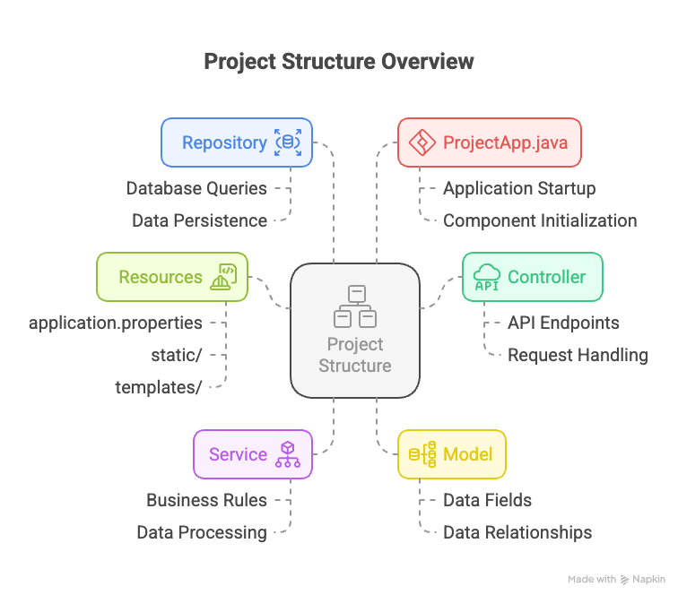

# User Management System Design Document

## 1. Problem Statement
The project aims to create a scalable and efficient user management system with the following key requirements:
- Handle user CRUD operations (Create, Read, Update, Delete)
- Provide fast data access and retrieval
- Ensure data persistence and reliability
- Support reactive programming paradigm
- Implement a caching mechanism for improved performance

## 2. Technical Architecture

### 2.1 Technology Stack
- **Framework**: Spring Boot 3.x with WebFlux
- **Programming Language**: Java 17
- **Data Storage**:
  - Primary Database: Elasticsearch
  - Cache Layer: Redis
- **API Style**: RESTful with reactive endpoints
- **Build Tool**: Maven

<!--  -->

### 2.2 Project Structure

## 3. Implementation Approach

### 3.1 Data Flow
1. **API Request** → Controller receives HTTP request
2. **Controller** → Routes to appropriate Service method
3. **Service** → Processes business logic
4. **Repository** → Handles data operations with the following strategy:
   - Check Redis cache first
   - If not in cache, query Elasticsearch
   - Update cache with new data
   - Return response reactively

## 4. Pros and Cons

- The system offers several advantages including high performance through Redis caching and Elasticsearch's fast search capabilities, along with excellent scalability due to non-blocking operations and distributed caching. The modular architecture allows for easy feature extensions and support for different data types.

- However, there are some trade-offs to consider. The dual database system introduces complexity in terms of operational management and cache synchronization, with a steeper learning curve for reactive programming. Resource consumption is higher due to running both Redis and Elasticsearch. Maintenance can be challenging as it involves managing two storage systems, debugging reactive code, and ensuring version compatibility across components.

## 5. Future Improvements

- Implement reactive connection in the ElasticSearch also.
- more modularity in code to support multiple data fetching techniques.

## 6. Assumptions and Considerations to be checked
1. Password storage needs encryption
2. Error handling could be more comprehensive
3. Configuration management could be more flexible
